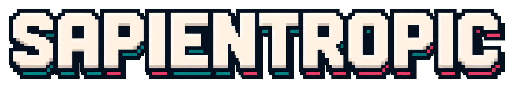

  

<h3>Building local-first agent infrastructure for memory, continuity, and signal work.</h3>

  I design tools that help agents and humans keep context, recover threads,
  and turn messy daily inputs into durable workflows.

  
  
  
  

  <a href="#featured-systems"><strong>Explore Projects</strong></a>
  /
  <a href="#featured-systems"><strong>Agent Skills</strong></a>
  /
  <a href="https://github.com/Sapientropic/t-sense-open-core"><strong>T-Sense</strong></a>
  /
  <a href="https://github.com/Sapientropic/codeksei"><strong>Codeksei</strong></a>

## What I Build

<table>
  <tr>
    <td width="33%">
      <strong>Companion agents</strong> 
      Local-first assistants that can keep timelines, reminders, reviews, diaries, and project context close to the work.
    </td>
    <td width="33%">
      <strong>Agent memory &amp; continuity</strong> 
      Workflows for recalling useful context, resuming long-running threads, and leaving durable state across tools.
    </td>
    <td width="33%">
      <strong>Signal workflows</strong> 
      Local scanners and report generators that turn noisy feeds into reviewable briefs and decisions.
    </td>
  </tr>
</table>

## Featured Systems

<table>
  <tr>
    <td width="50%">
      <a href="https://github.com/Sapientropic/codeksei"><strong>codeksei</strong></a> 
      Local-first companion agent infrastructure for memory, timeline, reminders, reviews, and project continuity. 
      <code>companion agents</code> / <code>local-first</code> / <code>automation</code>
    </td>
    <td width="50%">
      <a href="https://github.com/Sapientropic/t-sense-open-core"><strong>T-Sense open core</strong></a> 
      Local-first Telegram signal workflow for scanning accessible channels, filtering with Markdown profiles, and producing reviewable reports. 
      <code>open core</code> / <code>signal workflows</code> / <code>local reports</code>
    </td>
  </tr>
  <tr>
    <td width="50%">
      <strong>my-agent-skills</strong> 
      Internal personal agent skills for Codex, Claude Code, and Hermes workflows. 
      <code>skills</code> / <code>workflow assets</code> / <code>agent practice</code>
    </td>
    <td width="50%">
      <strong>CLI-Agent-Orchestration</strong> 
      Internal CLI worker manager for multi-agent dispatch, tracking, cost, and quality loops. 
      <code>multi-agent</code> / <code>CLI</code> / <code>quality loops</code>
    </td>
  </tr>
</table>

## Current Direction

I am working toward local-first AI companions, agent-native workflows, cross-tool memory, and human-in-the-loop automation that stays useful across long-running work.

## Working Style

I care about tools that reduce context loss, especially for long-running projects and attention-fragmented work. The best systems leave a trail you can return to: what happened, what matters now, and where to restart.

## Links

- [Codeksei](https://github.com/Sapientropic/codeksei)
- [T-Sense open core](https://github.com/Sapientropic/t-sense-open-core)
- [Public repositories](https://github.com/Sapientropic?tab=repositories)
